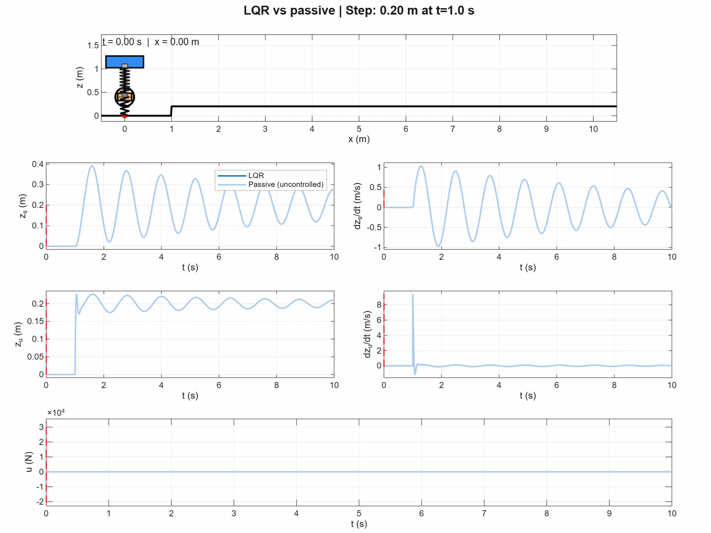
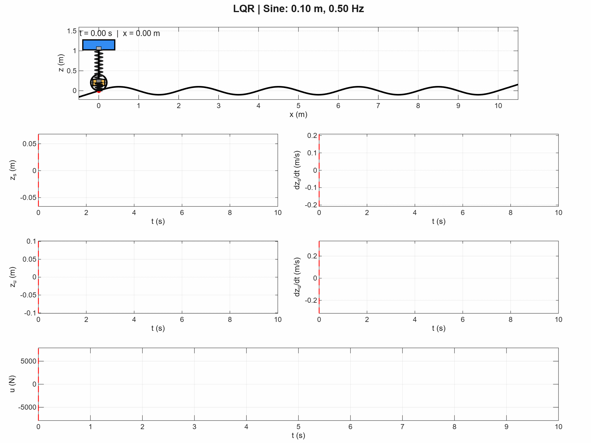

# Quarter-Car Control Lab

**Active suspension with PID and LQR** — a senior-level ME 4030 controls project by Sriram Krishnamoorthy, originally developed for Fall 2025.

Model a vehicle suspension, design feedback controllers, and investigate the tradeoff between a comfortable ride, road holding, and actuator effort.

## System model

A two-degree-of-freedom quarter-car model represents the vehicle body (sprung mass) and wheel assembly (unsprung mass). A spring and damper connect the masses; tire stiffness and damping connect the wheel to the road. An actuator applies equal and opposite forces between the body and wheel.

The road displacement is the disturbance, the actuator force is the control input, and suspension deflection is the controlled output. The model assumes linear springs and dampers, small vertical motions about static equilibrium, and an ideal actuator.

The published documents include corrections to the original course materials; see [model and metric clarifications](docs/clarifications.md).

See the [project handout](docs/project.pdf) for the assignment and the [state-space derivation](docs/state-space-model.pdf) for the model.

## Control design task

1. Formulate the equations of motion and state-space model.
2. Simulate the passive suspension as a baseline.
3. Design and tune PID and LQR controllers, including integral action.
4. Evaluate the response to step and sinusoidal road inputs.
5. Compare ride comfort, road holding, suspension travel, transient response, and control effort. Explain the compromises in your design.

## Expected learning outcomes

After completing the project, students should be able to:

- Translate a mechanical model into a state-space representation and interpret its states.
- Distinguish actuator inputs from external disturbances.
- Implement PID and LQR feedback and explain the role of integral action.
- Tune gains and cost weights using simulation and quantitative performance measures.
- Communicate controller strengths and limitations using plots and animations.

## Getting started

Use MATLAB with Control System Toolbox. The scripts use `tiledlayout` (introduced in R2019b). Interactive [`pidTuner`](https://www.mathworks.com/help/control/ref/pidtuner.html) for this MATLAB LTI model is included in Control System Toolbox; it is optional.

The reference solution has been [validated in MATLAB R2026b](VALIDATION.md), including all six controller/input combinations and the plotting/animation paths.

Open [`starter/main_file.m`](starter/main_file.m), complete the marked model and controller entries, and run it. The starter intentionally stops until the parameters and model have been filled in. The animation helper is in `shared/`.

## Solutions and animations

The [solution guide](solutions/README.md) explains the PID and LQR approaches, provides executable MATLAB code, and compares their responses with the passive suspension. It also records corrections to the original course implementation.

For controlled step inputs, faded blue traces show the full passive (uncontrolled) response as a fixed reference; the controlled response animates over it.

These GIFs are captured directly from the MATLAB animation window, including the moving suspension, physical displacement/velocity traces, and actuator force. Each shows 10 seconds of simulation at 10 frames per second, followed by a one-second hold. Drawing offsets are schematic; each plot uses the simulated values.

| Controller | Step road | Sinusoidal road |
|---|---|---|
| Passive | [Animation](media/animations/passive-step.gif) | [Animation](media/animations/passive-sine.gif) |
| PID | [Animation](media/animations/pid-step-comparison.gif) | [Animation](media/animations/pid-sine.gif) |
| LQR | [Animation](media/animations/lqr-step-comparison.gif) | [Animation](media/animations/lqr-sine.gif) |

See the [MATLAB animation screenshots and numerical results](solutions/README.md#results) for all six cases.

## Materials

- [Corrected LaTeX assignment](docs/project.pdf)
- [Detailed worked solution with MATLAB code](solutions/solution-notes.pdf)
- [LaTeX sources and build instructions](latex/README.md)
- [State-space model](docs/state-space-model.pdf)
- [Editable system diagram](docs/system-model.pptx)
- [Starter code](starter/main_file.m)
- [Reference solutions](solutions/README.md)

Released under the [MIT License](LICENSE).
