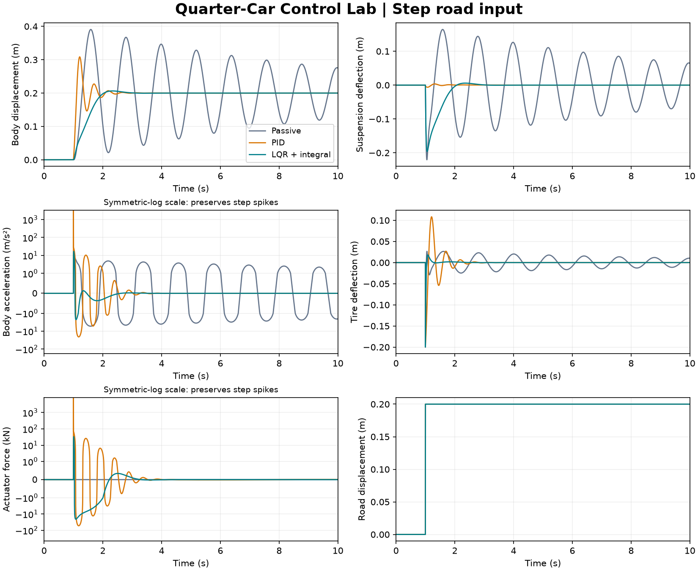
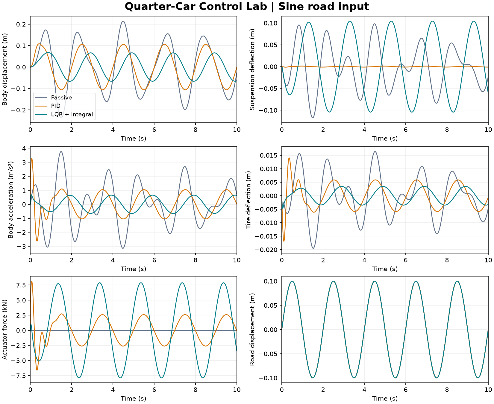

# Reference solutions

This guide accompanies the [ME 4030 project](../README.md). Start with the assignment before exploring these implementations.

## Model and feedback objective

Let $z_s$ and $z_u$ denote body and wheel displacements, $z_r$ the road displacement, and $s=z_s-z_u$ the suspension deflection. Positive actuator force acts upward on the body:

$$M_s\ddot z_s=-K_s s-C_s\dot s+u,$$

$$M_u\ddot z_u=K_s s+C_s\dot s-K_t(z_u-z_r)-C_t(\dot z_u-\dot z_r)-u.$$

The reference parameters are $M_s=2500$ kg, $M_u=320$ kg, $K_s=80000$ N/m, $C_s=350$ N·s/m, $K_t=500000$ N/m, and $C_t=15020$ N·s/m. They are stored with all tuning and input settings in [`config.json`](config.json).

The corrected [derivation](../docs/state-space-model.pdf) eliminates the road derivative using a transformed fourth state:

$$x=[z_s,\dot z_s,s,\eta]^T,\quad \alpha=C_s/M_s+C_s/M_u+C_t/M_u,$$

$$\eta=\dot s-(C_t/M_u)z_s+\alpha s+(C_t/M_u)z_r.$$

Thus $\dot x=Ax+B_u u+B_w z_r$ and $s=Cx$ with $C=[0,0,1,0]$. **The fourth state is not suspension velocity.** Recover it using $\dot s=CAx+CB_wz_r$, since $CB_u=0$.

Both controllers regulate suspension deflection toward zero. Ride comfort and tire deflection remain separate measures: minimizing suspension deflection alone need not give the best ride.

## Passive baseline

Set `control_mode = 'NONE'` to use $u=0$. This gives a useful reference for deciding whether feedback improves each performance measure. The unused integral state has a zero eigenvalue in passive mode; the four-state mechanical plant is stable.

## PID approach

The ideal PID law is

$$u=-K_p s-K_d\dot s-K_i\xi,\qquad \dot\xi=s.$$

The included gains are $K_p=208000$, $K_d=832000$, and $K_i=624000$, retained from the course example. In the transformed coordinates this becomes

$$u=-[K_p C+K_d CA,\ K_i]x_a-K_d CB_wz_r,\qquad x_a=[x^T,\xi]^T.$$

The road term is necessary when reconstructing the measured suspension velocity from these coordinates. It does not imply that a physical PID implementation must measure road displacement separately.

Tune the force-to-deflection plant with `pidTuner(ss(A,Bu,C,0),'PID')`, or adjust gains and compare simulations. Increasing gains can reduce deflection while demanding larger actuator forces. These gains illustrate the method; they are not claimed to satisfy every assignment target.

## LQR with integral action

Augment the plant with $\dot\xi=Cx$ and choose $u=-Kx_a$ to minimize

$$J=\int_0^\infty (x_a^TQx_a+u^TRu)\,dt.$$

The example uses $Q=\operatorname{diag}(3\times10^7,8\times10^7,8\times10^7,2\times10^7,2\times10^{10})$ and $R=0.01$. MATLAB's `lqr` computes the gain. The fourth weight penalizes the transformed state $\eta$, not physical suspension velocity. Weights depend on the state coordinates and units.

Increase selected state weights to prioritize their regulation, or increase $R$ to discourage control effort. Evaluate all performance measures after every tuning change. This example assumes full-state feedback and does not include an observer, actuator saturation, or anti-windup.

## Run the solution

Open and run [`quarter_car_demo_solution.m`](quarter_car_demo_solution.m). Select `NONE`, `PID`, or `LQR` and `step` or `sine` at the top. Set `show_animation=false` for plots and metrics only.

For a programmatic run, add this directory to the MATLAB path:

```matlab
r = simulate_quarter_car('LQR', 'step');
metrics = quarter_car_performance_eval(r);
disp(struct2table(metrics));
```

The script runs for 10 seconds at 1 ms intervals. The step is 0.2 m at 1 s; the sine has 0.1 m amplitude and 0.5 Hz frequency. The continuous sine and piecewise-constant step are propagated exactly using a matrix exponential; RMS values use exact interval energy integrals. Output plots are sampled at 1 ms.

## Results





See the [numerical comparison](results.md) and [machine-readable results](results.json). RMS measures use the entire 10-second record, including the initial transient. Step overshoot uses the known final road height; 2% settling time is measured from the step onset. A response still outside the band at the end is reported as not settled. Overshoot and settling time are not assigned to sinusoidal runs.

The ideal PID and tire damper can produce large force and acceleration changes for a sharp road step. The animations and plots show an ideal linear model, not a validated vehicle or a force-limited actuator. The supplied gains should be discussed critically against the assignment's performance targets.

## Corrected solution notes

The [solution notes](solution-notes.pdf), [model derivation](../docs/state-space-model.pdf), and [assignment](../docs/project.pdf) have been regenerated with consistent notation and equations. See [clarifications](../docs/clarifications.md) for the changes from the Fall 2025 materials. The original Box files remain unchanged.

The code uses the transformed state consistently, includes the correct PID road term, and computes RMS integrals without missing the fast step transient. Body overshoot and body settling time are supplemental metrics; suspension recovery uses a stated absolute band because percentage overshoot about a zero final deflection is undefined.

## Reproduce previews and validation

The repository includes a Python companion for generating the checked-in plots, GIFs, and result tables. MATLAB remains the course implementation.

```sh
python -m pip install -r tools/requirements.txt
python tools/build_previews.py
```

Run these commands from the repository root. The companion reads the same JSON parameters, checks the coordinate transformation against the physical equations, verifies closed-loop stability and step equilibria, and checks the PID force law. See [`VALIDATION.md`](../VALIDATION.md) for what was executed.

To regenerate the corrected PDFs after the results, install `reportlab` and run `python tools/build_documents.py`. The original editable slide and diagram export are retained in `docs/system-model.pptx` and `media/system-model.png`; the README uses the vector schematic.
